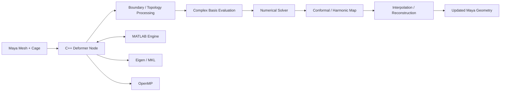
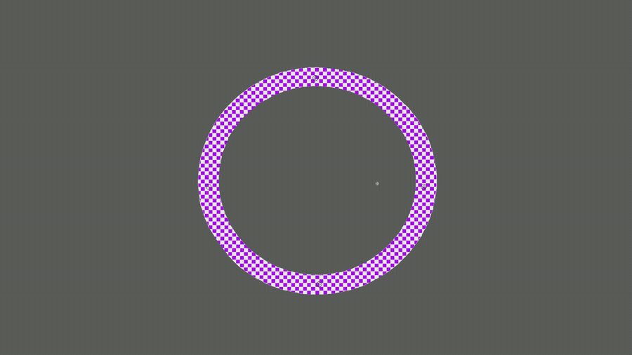

# Planar Shape Interpolation Deformer

A research-oriented Autodesk Maya C++ deformer for smooth planar shape deformation and interpolation using conformal and harmonic mapping techniques.

> **Public showcase:** The full implementation remains private because part of this project extends the published simply-connected method to multiply-connected domains with holes. This repository therefore exposes representative code from the published / simply-connected pipeline, while keeping the new hole-period correction and related research implementation private.

## Project overview

The project explores how to interpolate and deform 2D shapes while controlling geometric distortion and preserving stable behavior throughout an animation.

The baseline simply-connected formulation follows previously published work in planar harmonic / conformal shape interpolation. My implementation integrates that mathematical pipeline into a custom Autodesk Maya deformer and extends it with engineering work around C++/MATLAB integration, numerical optimization, diagnostics, and interactive performance. The ongoing research component focuses on multiply-connected domains with holes.

## Tech stack

- **C++**
- Autodesk Maya C++ API
- Eigen
- Intel MKL-backed numerical routines
- MATLAB Engine API
- OpenMP
- Complex linear algebra
- Numerical optimization
- Git / Visual Studio

## Architecture

## Public code samples

The public repository now contains representative implementation code from the simply-connected pipeline, not only documentation.

- [`examples/numerics/symmetric_dirichlet.cpp`](examples/numerics/symmetric_dirichlet.cpp) - Symmetric Dirichlet energy, handle penalty, complex gradient, Hessian blocks, and real Hessian assembly used by the Newton optimization path
- [`examples/numerics/cauchy_basis_simply_connected.cpp`](examples/numerics/cauchy_basis_simply_connected.cpp) - Cauchy coordinate and derivative basis evaluation for a single polygonal cage loop
- [`examples/numerics/reconstruct_from_derivative.cpp`](examples/numerics/reconstruct_from_derivative.cpp) - reconstruction of vertex positions from a complex derivative field by trapezoidal edge integration over a spanning tree
- [`examples/cpp/matlab_matrix_bridge.cpp`](examples/cpp/matlab_matrix_bridge.cpp) - dense real/complex matrix transfer across the MATLAB Engine boundary, including layout conversion and synchronization
- [`examples/cpp/maya_deformer_node_skeleton.cpp`](examples/cpp/maya_deformer_node_skeleton.cpp) - Maya deformer-node structure and keyable mode/interpolation attributes with research-specific implementation removed
- [`examples/performance/performance-engineering-notes.md`](examples/performance/performance-engineering-notes.md) - concrete bottlenecks and optimizations involving Eigen/MKL kernels, caching, OpenMP, MATLAB IPC, and factorization reuse

The numerical samples deliberately stop at the simply-connected case. Logarithmic hole bases, period-closing correction, and the multiply-connected solver are not published here.

## What I implemented

- Custom Maya deformer node with bind-time and per-frame computation paths
- Cauchy-coordinate based deformation infrastructure
- Conformal and harmonic deformation modes
- Interpolation between endpoint maps
- Numerical reconstruction of maps from complex differential data
- Symmetric Dirichlet energy, gradient, Hessian, and Newton-style optimization infrastructure
- Injectivity and distortion checks used during optimization
- Debugging and diagnostic tools for complex fields and numerical behavior
- Extension to planar domains containing holes, including period-closing correction - kept private in this showcase

## Performance engineering

A major part of the project was turning a mathematically correct prototype into an interactive system. I profiled the deformation pipeline and optimized several expensive paths.

Examples include:

- Replacing scalar per-vertex evaluation with matrix-vector kernels using Eigen / MKL
- Caching basis data that was previously recomputed in hot loops
- Parallelizing suitable bind-time work with OpenMP
- Reducing large MATLAB-to-C++ memory transfers
- Cutting unnecessary MATLAB Engine round trips
- Reusing numerical factorizations and intermediate matrices where possible

The implementation targets meshes with tens of thousands of vertices, so memory traffic and cross-process solver calls became as important as the asymptotic algorithm itself.

## Numerical validation

Solver and interpolation changes were checked using a combination of:

- Endpoint consistency tests
- Finite-difference validation of numerical derivatives
- Regression tests between deformation modes
- Injectivity / fold detection
- Seeded numerical parity tests before and after performance optimizations

## Engineering challenges

### C++ / MATLAB integration

The solver uses the MATLAB Engine from a C++ Maya plugin. This required careful handling of matrix ownership, complex-valued data, synchronization, and the cost of cross-process calls.

### Interactive performance

Operations that are acceptable during an offline numerical experiment can be too expensive inside Maya's per-frame deformation path. I separated bind-time, endpoint, and per-frame work and introduced caching and optimized linear-algebra kernels accordingly.

### Multiply connected domains

Shapes containing holes introduce additional consistency constraints during interpolation. That extension is the research-specific part of the project, and its period-closing implementation is intentionally not published in this repository.

## Results / demo

### Shape interpolation

Smooth interpolation between planar source and target shapes inside the Maya deformer.

### Deformation behavior

Interactive deformation showing the continuous evolution of the mapped geometry.

### Interpolation example

A second interpolation example demonstrating the method on a different source / target configuration.

### Additional deformation example

An additional Maya result illustrating the behavior of the implemented interpolation pipeline.

## Repository scope

This showcase intentionally draws a clear line between two parts of the project:

**Public:** representative C++ from the simply-connected / published pipeline, integration code, plugin architecture, and performance-engineering work.

**Private:** the new multiply-connected extension, logarithmic hole basis handling, period-closing solver, and implementation details specific to interpolation on domains with holes.

## Author

**Yair Nachum**  
B.Sc. Computer Engineering, Bar-Ilan University  
Digital Geometry Processing project / ongoing academic work  
GitHub: [yairnachum](https://github.com/yairnachum)
