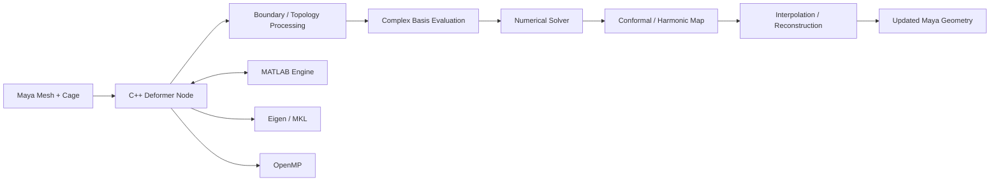

# Planar Shape Interpolation Deformer

A research-oriented Autodesk Maya C++ deformer for smooth planar shape deformation and interpolation using conformal and harmonic mapping techniques.

> **Public showcase:** The full implementation remains private because this project is part of ongoing academic work. This repository presents the engineering scope, architecture, selected sanitized C++ extracts, and performance notes without publishing the complete research code.

## Project overview

The project explores how to interpolate and deform 2D shapes, including multiply connected domains with holes, while controlling geometric distortion and preserving stable behavior throughout an animation.

I implemented the system as a custom Autodesk Maya deformer node in C++, with numerical kernels split between native C++ and MATLAB-based solver components.

## Tech stack

- **C++**
- Autodesk Maya C++ API
- Eigen
- Intel MKL-backed numerical routines
- MATLAB Engine API
- OpenMP
- Complex linear algebra
- Numerical optimization
- Git / Visual Studio

## Architecture

## Selected public engineering samples

The research core is intentionally private, but these sanitized samples show the surrounding systems work:

- [`examples/cpp/matlab_matrix_bridge.cpp`](examples/cpp/matlab_matrix_bridge.cpp) - dense real/complex matrix transfer across the MATLAB Engine boundary, including layout conversion and synchronization
- [`examples/cpp/maya_deformer_node_skeleton.cpp`](examples/cpp/maya_deformer_node_skeleton.cpp) - Maya deformer-node structure and keyable mode/interpolation attributes with research-specific implementation removed
- [`examples/performance/performance-engineering-notes.md`](examples/performance/performance-engineering-notes.md) - concrete bottlenecks and optimizations involving Eigen/MKL kernels, caching, OpenMP, MATLAB IPC, and factorization reuse

These files are representative engineering extracts rather than a runnable copy of the private research implementation.

## What I implemented

- Custom Maya deformer node with bind-time and per-frame computation paths
- Cauchy-coordinate based deformation infrastructure
- Conformal and harmonic deformation modes
- Interpolation between endpoint maps
- Support for planar domains containing holes
- Period-closing correction for multiply connected interpolation
- Numerical reconstruction of maps from complex differential data
- Injectivity and distortion checks used during optimization
- Debugging and diagnostic tools for complex fields and numerical behavior

## Performance engineering

A major part of the project was turning a mathematically correct prototype into an interactive system. I profiled the deformation pipeline and optimized several expensive paths.

Examples include:

- Replacing scalar per-vertex evaluation with matrix-vector kernels using Eigen / MKL
- Caching basis data that was previously recomputed in hot loops
- Parallelizing suitable bind-time work with OpenMP
- Reducing large MATLAB-to-C++ memory transfers
- Cutting unnecessary MATLAB Engine round trips
- Reusing numerical factorizations and intermediate matrices where possible

The implementation targets meshes with tens of thousands of vertices, so memory traffic and cross-process solver calls became as important as the asymptotic algorithm itself.

## Numerical validation

Solver and interpolation changes were checked using a combination of:

- Endpoint consistency tests
- Finite-difference validation of numerical derivatives
- Regression tests between deformation modes
- Injectivity / fold detection
- Seeded numerical parity tests before and after performance optimizations

## Engineering challenges

### C++ / MATLAB integration

The solver uses the MATLAB Engine from a C++ Maya plugin. This required careful handling of matrix ownership, complex-valued data, synchronization, and the cost of cross-process calls.

### Interactive performance

Operations that are acceptable during an offline numerical experiment can be too expensive inside Maya's per-frame deformation path. I separated bind-time, endpoint, and per-frame work and introduced caching and optimized linear-algebra kernels accordingly.

### Multiply connected domains

Shapes containing holes introduce additional consistency constraints during interpolation. The project includes a period-closing stage so reconstructed differential fields remain globally consistent around hole loops.

## Results / demo

<!-- Add a short GIF or video showing:
1. source shape,
2. target shape,
3. t = 0 -> 1 interpolation,
4. a holed-domain example,
5. checkerboard visualization for distortion / injectivity.
-->

## Repository scope

The public showcase contains selected engineering extracts and documentation, but intentionally omits the complete C++ / MATLAB research implementation, solver internals, unpublished algorithm code, private Maya scenes, and research assets.

## Author

**Yair Nachum**  
B.Sc. Computer Engineering, Bar-Ilan University  
Digital Geometry Processing project / ongoing academic work  
GitHub: [yairnachum](https://github.com/yairnachum)
